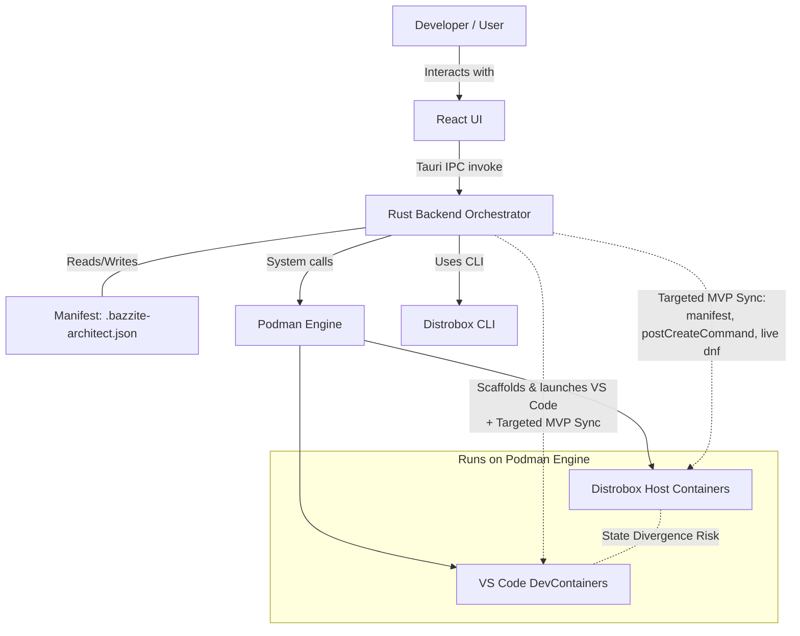
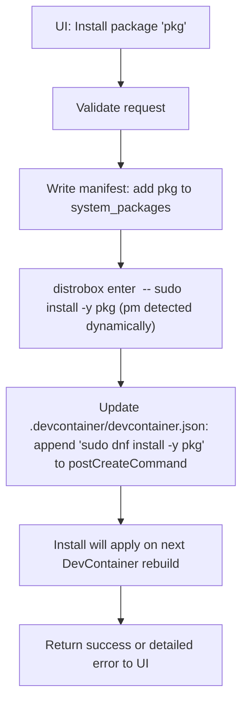
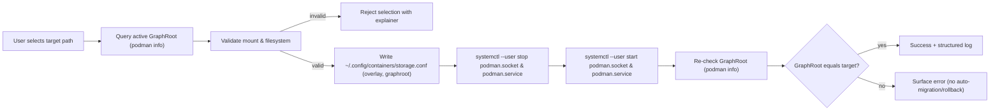
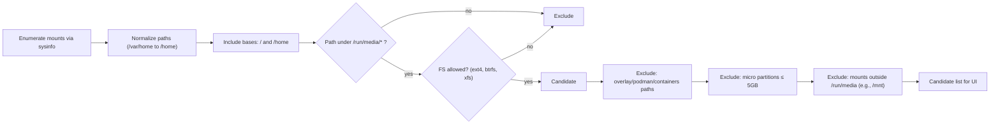
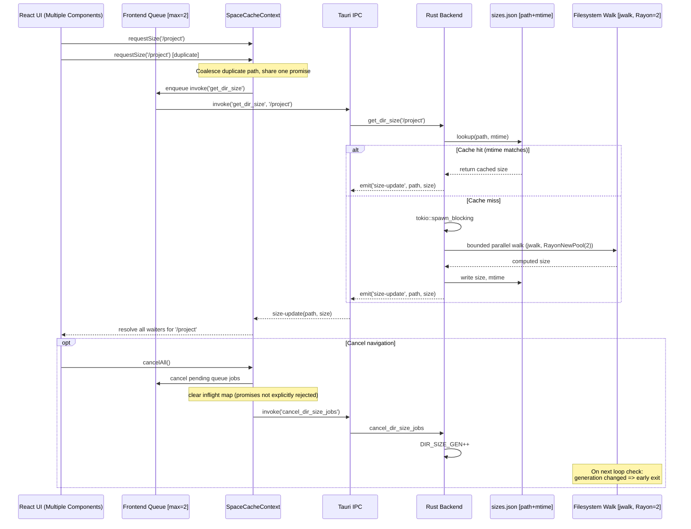
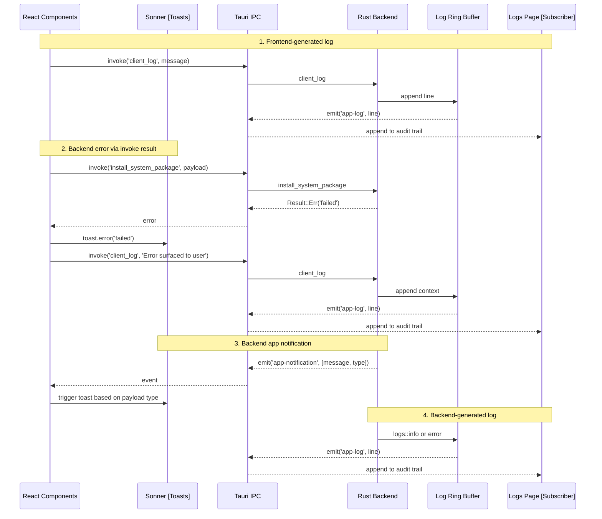
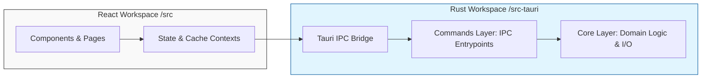

# 🏛️ Bazzite Architect: Technical Design Authority

   


---

##  Table of Contents

| Section | Strategic Value |
| :--- | :--- |
| 🧩 [**1. Overview**](#1-introduction--system-overview) | Mission statement and the core architectural problem. |
| 🚧 [**2. Boundaries**](#2-system-boundaries--non-goals) | Explicit scope control and maintainability constraints. |
| 🛠️ [**3. Tech Stack**](#3-technology-stack--interfaces) | Rationale for the Rust/Tauri/Podman stack. |
| 🏗️ [**4. Scaffolding**](#4-core-concepts--scaffolding) | Automated project initialization and environment logic. |
| ❤️ [**5. Sync Engine**](#5-the-sync-engine--the-manifest-the-heart) | The declarative heart: Preventing state divergence. |
| 💾 [**6. Storage**](#6-storage-orchestration--resource-management) | Safe Podman GraphRoot relocation & heuristics. |
| ⚡ [**7. Optimization**](#7-performance--i-o-optimization) | Concurrency, request coalescing, and I/O safety. |
| 🛡️ [**8. Resilience**](#8-failure-modes--error-handling) | Unified observability and fail-safe propagation. |
| 🔐 [**9. Security**](#9-security--isolation) | Threat model and rootless execution boundaries. |
| 📁 [**10. Structure**](#10-project-structure--code-guide) | Modular Refactor: The Core-Command-View pattern. |


---

##  1. Introduction & System Overview
### 1.1 Executive Summary
Bazzite Architect is a native, desktop-based environment orchestrator designed specifically for immutable Linux distributions, with a primary focus on Bazzite and Fedora Kinoite. It bridges the gap between host-level containerization (Distrobox/Podman) and IDE-specific isolated environments (VS Code DevContainers). It provides developers with reproducible, zero-friction workspaces without compromising the immutable and atomic nature of the base operating system.

### 1.2 The Immutable-OS Problem
Traditional Linux development relies heavily on host package managers (e.g., `sudo dnf install`). On immutable systems like Bazzite, the root filesystem is read-only to ensure system stability, security, and atomic updates. 

While container technologies exist to bypass this limitation—such as **Distrobox** for terminal/host integration and **DevContainers** for IDE isolation—they operate in strict silos. This fragmentation creates severe UX friction: developers must manually manage storage limits, synchronize dependencies across different container runtimes, and write repetitive boilerplate configurations just to initialize a local project. 

Bazzite Architect abstracts this entire complexity behind a unified, GUI-driven control plane.

### 1.3 High-Level Architecture Diagram
The following diagram illustrates how the user interfaces with the application and how the Rust backend orchestrates the underlying system components to mitigate state divergence through targeted synchronization.



---

## 2. System Boundaries & Non-Goals
To maintain a focused, maintainable, and reliable architecture, it is crucial to define the explicit boundaries of the Bazzite Architect orchestrator. The following are conscious "non-goals" for this project:

* **Not a Language Package Manager:** Bazzite Architect strictly manages *system-level* dependencies (e.g., `gcc`, `openssl-devel`, `htop`). It does not attempt to wrap or manage language-specific package managers like `npm`, `pip`, or `cargo`. Language dependencies are naturally synchronized because both the Distrobox container and the DevContainer mount the exact same host workspace directory.
* **Not a DevContainer Replacement:** The project does not aim to reinvent the wheel regarding IDE isolation. Bazzite Architect does not replace the `devcontainer.json` specification or the VS Code Dev Containers extension. Instead, it acts as a higher-level orchestrator that *scaffolds* these configurations and ensures they remain aligned with the host's Distrobox state.
* **Not a Universal Multi-Distro Tool (in V1.0):** While containerization is technically agnostic, the current sync-engine is deeply optimized for Fedora-based images (specifically utilizing the `dnf` package manager), mirroring the Bazzite/Kinoite host. Supporting Debian (`apt`) or Alpine (`apk`) target containers is explicitly out of scope for the MVP to reduce state-management complexity.
* **Not a General-Purpose Podman GUI:** The application does not provide screens to manage arbitrary Dockerfiles, custom image registries, or network bridges. It remains laser-focused on the *development environment* lifecycle.


---

## 3. Technology Stack & Interfaces
The architecture is built on a modern, decoupled stack, carefully chosen to prioritize native system performance, low resource footprint, and deep OS integration.

### 3.1 Core Technologies
* **Backend / Orchestrator (Rust & Tauri):** Instead of relying on heavy Electron runtimes, Bazzite Architect utilizes Tauri. The Rust backend provides the low-level, memory-safe system access required to safely execute asynchronous OS commands (interfacing with Podman and Distrobox) while maintaining a negligible background footprint.
* **Frontend (React):** A declarative React frontend handles the complex state of multiple environments, storage scans, and real-time notifications/logs.
* **Container Runtimes (Podman & Distrobox):** The application leverages the native container tools pre-installed on Bazzite. Podman runs rootless containers, ensuring security, while Distrobox tightly integrates those containers with the host OS (e.g., exporting binaries to the host application menu). VS Code DevContainers are orchestrated by the VS Code Dev Containers extension; Bazzite Architect scaffolds the .devcontainer configuration and launches VS Code but does not manage the DevContainer lifecycle directly.

### 3.2 OS-Native Design (UX/UI)
A key architectural principle of Bazzite Architect is that it should feel like a first-class citizen of the operating system, not a web wrapper. The UI is custom-built, drawing heavy inspiration from the **GNOME/Libadwaita** design language. This ensures visual consistency with the native Bazzite desktop environment, providing users with familiar paradigms, dark mode support, and native-feeling popovers and modals.

### 3.3 The Communication Layer (IPC)
The system strictly separates presentation from execution. The React frontend has zero direct access to the filesystem or the operating system. 
All interactions between the UI and the host OS happen via **Tauri's Inter-Process Communication (IPC)**. The frontend issues asynchronous `invoke` calls to specific Rust commands (e.g., `invoke("create_environment")`). The Rust backend acts as the gatekeeper, validates the request, executes the necessary CLI calls, and returns serialized JSON payloads or error states back to the UI.


---

## 4. Core Concepts & Scaffolding

At the heart of Bazzite Architect is the concept of an "Environment." Rather than treating containers, project directories, and IDE configurations as separate, disjointed entities, the system unifies them into a single, cohesive unit.

### 4.1 The "Environment" Entity
An Environment in Bazzite Architect consists of four tightly coupled layers:
1. **The Host Workspace:** A local directory residing on the user's actual filesystem (e.g., `~/Projects/Python_Project`). This ensures code is never trapped inside a container volume and remains accessible to host GUI tools.
2. **The Distrobox Container:** A rootless container created via `distrobox create` (using a Fedora toolbox base), optionally with an environment-specific home mount and an initial setup snippet to install baseline tools.
3. **The DevContainer Configuration:** An automatically generated `.devcontainer` folder containing the `devcontainer.json` file. This defines the IDE container image, postCreate steps where applicable, and recommended extensions.
4. **The Synchronization Manifest:** The `.bazzite-architect.json` file, which acts as the single source of truth for required system-level packages (MVP: `system_packages`).

### 4.2 Project Scaffolding & Templates
To eliminate boilerplate configuration, Bazzite Architect provides an automated templating engine. When a user creates a new environment, the Rust backend executes a deterministic scaffolding sequence:
* Provisions the host project directory (and an environment-specific home mount if requested).
* Creates language-specific project scaffolding (e.g., README, minimal source files, build config) and `.vscode/extensions.json`.
* Generates `.devcontainer/devcontainer.json` with a Fedora-based image and, where applicable, a `postCreateCommand` (e.g., `dnf install ...`) and recommended extensions.
* Initializes the `.bazzite-architect.json` manifest (MVP tracks `system_packages`).

Note: The orchestrator now guarantees minimal baseline toolchain/project files are created during scaffolding (for example: `requirements.txt` for Python, `package.json` for Node/React, `Cargo.toml` for Rust, `CMakeLists.txt` for C/C++, `pom.xml` for Java, and `*.csproj` for C#). This prevents DevContainer `postCreateCommand` steps from failing on initial open due to missing files.

C# / .NET: The new C# template scaffolds a minimal Program.cs and a project file targeting .NET 8.0. The generated DevContainer and the Distrobox environment use the official .NET SDK image (`mcr.microsoft.com/dotnet/sdk:8.0`) and recommend the VS Code extensions `ms-dotnettools.csharp` and `ms-dotnettools.csdevkit`. The DevContainer is configured to run a lightweight `dotnet restore || true` in its start hook to fetch NuGet packages without blocking the editor attach sequence.

From there, opening VS Code is a separate action invoked from the app. The result is a ready-to-use, containerized IDE setup with zero manual JSON editing required.

### 4.3 Open Mode: Terminal vs. VS Code (UI Button)

A new explicit "Open" control offers users two distinct runtime entry points for an Environment: "Open in Terminal" (Distrobox host terminal) and "Open in VS Code" (DevContainer/IDE attach). This toggle simplifies the mental model and makes lifecycle and provisioning semantics explicit.

- UX semantics
  - Open in Terminal: performs a non-blocking entry into the Distrobox environment (e.g., `distrobox enter <env>`). This path is intended for immediate CLI work and live package installs; changes applied here reflect the host/Distrobox universe immediately.
  - Open in VS Code: launches VS Code attached to the generated DevContainer (`devcontainer` flow). The DevContainer lifecycle is preserved (build/rebuild, postCreate/postStart hooks apply). Long-running system package installs should be deferred to postStart so they do not block agent attach.

- Architectural implications
  - Single Source of Truth: both entry paths read/write the same manifest (.bazzite-architect.json). The manifest controls desired system packages; a change in the Terminal path triggers a live Distrobox install and appends the required steps to the DevContainer hooks so parity is achieved on the next container rebuild.
  - Provisioning guarantees: "Open in Terminal" is suitable when a developer needs immediate CLI access (fast feedback). "Open in VS Code" is the canonical path for IDE-attached workflows; it must preserve the agent startup semantics described in Section 4.x (move heavy installs to postStart).
  - Sync visibility: when a live package install is performed via the Terminal path, the UI shows a structured progress/log stream and marks the manifest/devcontainer.json as modified so the user understands the eventual DevContainer rebuild requirement.

- Security & UX guidance
  - Default suggestion: surface a short explainer tooltip/warning when the user chooses "Open in Terminal" if the environment mount includes a host $HOME (risk of secret exposure).
  - Recommended default button: default to "Open in VS Code" for new environments to encourage the zero-config IDE flow; expose "Open in Terminal" as the explicit alternative for advanced users.

- Implementation notes
  - Command routing: implement a single handler that accepts a launch-mode enum { Terminal, VSCode } and orchestrates:
    1. Ensure manifest and .devcontainer are up-to-date.
    2. For Terminal: invoke the host executor (build_host_command_async) -> `distrobox enter <env>` (non-blocking); stream process logs.
    3. For VSCode: call open_in_vscode / devcontainer flow used today.
  - Telemetry and logging: emit an app-notification/log event for the chosen mode to aid diagnostics and to audit whether users typically prefer one path.
  - Tests: add integration tests to assert that manifest edits performed via Terminal are persisted and that DevContainer hooks reflect those edits after the next rebuild.


### 4.4 DevContainer Lifecycle Hooks (Podman & Toolbox Integration)

On immutable host systems (for example: Bazzite/Kinoite) and when leveraging rootless Podman via toolbox/distrobox, we discovered a critical lifecycle interaction between DevContainer hooks and the VS Code agent attach sequence.

- Problem: Heavy, blocking provisioning steps (for example: long `dnf install` chains, language toolchain bootstrap scripts) placed in `postCreateCommand` can stall the container creation phase long enough that the VS Code server/agent fails to attach reliably. The symptom is a successful scaffold with a zero exit code, but VS Code's UI remains unpopulated (empty File Explorer) and the DevContainer log ends with messages like "Git credential helper not enabled." The creation step completes, but the agent handshake has effectively been blocked.

- Decision / Rationale: To ensure a responsive, consistent UX, all blocking dependency provisioning (system packages, compilers, large package installs) MUST be deferred to `postStartCommand`. `postStartCommand` is executed after the container has started and VS Code is attached, so it cannot block the critical agent startup handshake. This design choice prioritizes "responsive UI over blocking scaffolding" for toolbox/Podman-based workflows.

- Implementation notes and recommendations:
  * Move heavy install chains from `postCreateCommand` -> `postStartCommand` in generated `devcontainer.json` for Fedora/toolbox images.
  * If a task must run only once, use a small marker file (e.g., `.bazzite/first_run_done`) and have `postStartCommand` check that marker before running the heavy steps. Alternatively, keep an extremely lightweight `postCreateCommand` that writes the marker and performs no blocking installs.
  * Avoid backgrounding hacks that detach the install process; instead use the lifecycle hook semantics to guarantee correct sequencing.
  * This is a platform-specific hedge against the idiosyncrasies of rootless Podman and toolbox, and is documented here to prevent future regressions.

This principle is a deliberate trade-off: we accept that dev-time provisioning may occur after the IDE is attached (and visible) in order to guarantee the UI and agent lifecycle remain healthy. The manifest & sync engine remain the single source of truth for required system packages; the orchestration simply schedules their application at a safer lifecycle point.

### 4.4 IDE Integration & Zero-Config Philosophy

To deliver a true "zero-config" C++ experience on immutable hosts, the scaffolding engine adopted a "Preset-first" strategy rather than relying on editor-side heuristics or legacy `.vscode` hacks.

- Modern CMake Orchestration:
  * The engine generates a `CMakePresets.json` at the project root with a default configure preset that uses `Ninja` and explicitly sets `CMAKE_C_COMPILER`/`CMAKE_CXX_COMPILER` to the native `gcc`/`g++` available in the container. This enforces a reproducible configure step and avoids the VS Code CMake Tools "Select a Kit" prompt because the compilers are specified declaratively in the preset.
  * The preset also enables `CMAKE_EXPORT_COMPILE_COMMANDS=ON` so tooling can consume the compiler invocation database.

- IntelliSense Synchronization:
  * After configuring with the preset, CMake emits `compile_commands.json` in the build directory. The scaffolder injects a `.vscode/c_cpp_properties.json` that points the VS Code C/C++ IntelliSense provider to `${workspaceFolder}/build/compile_commands.json` and sets a matching `compilerPath`/`intelliSenseMode` and C/C++ standard. This binds the IDE's diagnostics directly to the compiler's reality and eliminates false-positive include errors.

- I/O Strategy & Responsiveness:
  * Both `CMakePresets.json` and `.vscode/c_cpp_properties.json` are written using the async_files pipeline (tokio-backed I/O) so scaffolding remains non-blocking and the frontend receives incremental progress updates.

- Minimal Editor Surface:
  * The orchestrator prefers upstream, well-supported mechanisms (CMake presets + compile_commands) over brittle editor-specific workarounds. This reduces maintenance cost and produces a consistent experience across VS Code variants and CMake Tools versions.

Outcome: With a preset-first approach and explicit compile-commands wiring, opening a newly scaffolded C++ project should configure and provide fully working IntelliSense without any user intervention or popups. This is now a documented, intentional design decision to preserve the "ready-to-code" promise of the tool.

---

## 5. The Sync Engine & The Manifest (The Heart)

### 5.1 The "Two Universes" Problem (State Divergence)
On immutable hosts with containerized development environments, there are effectively two universes that relate to the same task but are technically decoupled:

1. Distrobox universe: A host-integrated container (rootless, Podman) where CLI tools and build toolchains are often installed.
2. DevContainer universe: An IDE-centric container session managed by VS Code with its own lifecycle (build/rebuild, postCreate, extensions).

Without orchestration, these universes drift quickly. Typical symptoms include:
- Missing packages: A package is installed in Distrobox but absent in the DevContainer (or vice versa).
- Version drift: Different package versions lead to hard-to-reproduce failures.
- Configuration drift: Diverging repos/flags/env setup across the two worlds.
- Temporary "hotfix" installs: Manually installed via shell, not documented, and lost on the next rebuild.

Bazzite Architect addresses this divergence by centralizing all system packages and relevant sync steps through a Sync Engine, recorded in the manifest. In the current MVP, manual, ad-hoc in-container changes are not auto-detected; reconciliation/adoption flows are planned.

### 5.2 The .bazzite-architect.json Manifest as Single Source of Truth
The manifest is the sole authoritative source for the desired target state of system-wide dependencies in an environment.

MVP schema (simplified):

```
{
  "version": 1,
  "system_packages": [
    "gcc",
    "make",
    "openssl-devel"
  ]
}
```

Guiding principles (MVP):
- Declarative: The manifest describes the desired state for system_packages; the Sync Engine updates the Distrobox container immediately and prepares the DevContainer via postCreateCommand.
- Write authority: The manifest is modified exclusively by the orchestrator in response to UI actions.
- Observability: Changes are written synchronously and surfaced to the user via toasts/logs. There is currently no automatic rollback on failure.
- Future-proof: Additional fields (e.g., alternate repos, post-create queues) can be versioned without breaking MVP semantics.

### 5.3 Sequence Diagram: The exact sync flow when installing a package
The following top-down flowchart shows the orchestration when the user selects a system package to install in the UI. The goal is to keep the Distrobox and DevContainer universes consistent without forcing unnecessary rebuilds.

<div align="center">


</div>

#### 5.3.1 Current behavior and guarantees (MVP):
- Synchronous writes: The manifest and devcontainer.json are updated before attempting the live install. There is no rollback if the install fails; the error is surfaced to the user.
- Idempotence: Duplicate entries in the manifest are avoided. Live install relies on the package manager’s own idempotence semantics.
- DevContainer: No live install is performed. Changes apply on the next DevContainer rebuild via postCreateCommand.
- Resilience: There is no automatic retry/backoff yet; failures are reported to the user.

#### 5.3.2 Planned improvements:
- Transactional updates (rollback on failure across steps).
- Retry/backoff policies for transient repo/network errors.
- Drift detection and adopt/remove flows for manual in-container changes.
- Optional “Rebuild now” action to apply DevContainer changes immediately.

### 5.3.3 DevContainer orphan cleanup on environment delete

A practical lifecycle problem we encountered in the field is "zombie" DevContainers that outlive their companion Distrobox environment. If a DevContainer remains running after a Distrobox environment is removed, and the user later recreates an environment that reuses the same host path, VS Code may reattach to the orphaned container. Because the orphaned container's mounts and inodes can be stale, this commonly manifests as an empty File Explorer and broken mounts.

Mitigation implemented in the MVP:

- Best-effort host cleanup: When the user deletes an environment and the backend determines a host project path, the commands layer performs a best-effort host-side Podman cleanup to remove any containers labeled by VS Code as belonging to that workspace (`devcontainer.local_folder=<PROJECT_PATH>`).
- Host delegation: Because the backend may run inside a Distrobox during development, all host-level Podman calls are delegated through the host executor (via `build_host_command_async`) so the cleanup runs on the host and can see host containers.
- Path normalization & matching robustness:
  - Trailing slashes are trimmed before matching (e.g., `/home/foo/` → `/home/foo`).
  - Both `/home/...` and `/var/home/...` variants are queried to accommodate Silverblue/Bazzite symlink layouts.
  - Each variant is checked independently and any matching container IDs are removed with `podman rm -f`.
- Non-fatal: The cleanup is strictly best-effort. Podman failures, missing binaries, or empty matches are logged but do not cause the overall delete operation to fail. This guarantees users are not blocked by peripheral cleanup issues.

Rationale: this targeted cleanup closes a practical UX loop—preventing VS Code from reattaching to stale containers—while preserving a fail-safe deletion flow and maintaining the immutable-host principles described above.

Outcome: With a declarative manifest and immediate application in Distrobox, environments remain consistent enough for day-to-day work. DevContainer parity is ensured on the next rebuild via postCreateCommand.


---

## 6. Storage Orchestration & Resource Management

On handhelds and other Bazzite installations with constrained root SSDs, rootless Podman’s default storage location (GraphRoot) quickly accumulates container images and writable layers. Without explicit control, this bloats the primary partition, potentially causing system degradation or atomic update failures. Bazzite Architect provides a guided, safe mechanism to relocate Podman’s per-user storage to a developer-chosen drive, keeping the immutable system lean.

### 6.1 Configuration & State Management
When a user allocates a new storage location, the orchestrator performs a controlled reconfiguration of the container engine without requiring elevated privileges:
* **State Detection:** Reads the active GraphRoot dynamically via `podman info --format '{{.Store.GraphRoot}}'` to ensure UI accuracy.
* **Configuration Injection:** Writes a user-scoped configuration to `~/.config/containers/storage.conf`, explicitly setting `storage.driver = "overlay"` and `storage.graphroot = "<target>/podman-data"`.
* **Service Orchestration:** Cleanly restarts the user-level Podman socket (`systemctl --user stop podman.socket podman.service` followed by `start`) to apply changes.
* **Graceful Reset:** Reverting to the default location safely deletes the custom `storage.conf`, allowing Podman to fall back to its standard behavior.
* **Path Normalization:** For display and comparison, the active GraphRoot path is canonicalized where possible and normalized to treat `/var/home` as `/home`, ensuring stable active-path detection across Bazzite/Kinoite setups.



### 6.2 Disk Discovery & Strict Exclusion Logic
The Rust backend utilizes `sysinfo` to enumerate disks, but applies aggressive filtering to prevent users from bricking their environments.



* **Allowed Scopes:** Only targets system/home mounts (`/` and `/home`) and external removable media strictly under `/run/media`.
* **Intentional Exclusions:**
  * Arbitrary mounts outside `/run/media` (e.g., `/mnt` or custom bind mounts) are hidden to prevent interference with admin-managed paths.
  * For external removable mounts, only `ext4`, `btrfs`, and `xfs` are allowed; non-Linux filesystems (e.g., exFAT, NTFS, most FUSE/network filesystems) are excluded. System (`/`) and home (`/home` or `/var/home`) entries are included as-is.
  * Ephemeral, overlay, or container-related mounts (paths containing `overlay`, `podman`, or `containers`) are ignored.
  * Micro-partitions (≤ 5 GB) are excluded to prevent misconfiguration on boot/recovery volumes.
* **Path Normalization & Representation:** To align with Bazzite/Kinoite rpm-ostree semantics, `/var/home` is normalized to `/home`. In the UI, root (`/`) and home are represented as the user's `HOME` path, ensuring stable comparisons and reflecting Podman’s default behavior.


### 6.3 Filesystem & OverlayFS Constraints
Podman relies on the `overlay` storage driver in rootless mode.
* `ext4` and `btrfs` are recommended as fully supported, native choices for overlayfs.
* `xfs` is permitted, but overlayfs strictly requires XFS to be formatted with `ftype=1` (d_type support). While standard on modern desktop installs, the picker does not validate this at selection time.

### 6.4 MVP Limitations & Scope
* **No Auto-Migration:** Modifying the GraphRoot does not automatically migrate existing images. Users must re-pull images or manually clean the old location (e.g., `podman system prune`). This deliberate design choice prevents long-running, blocking I/O operations.
* **User-Scope Only:** Orchestration strictly targets per-user rootless Podman. System-wide daemon configuration is out of scope.

### 6.5 Resiliency & Observability
Drive scanning and configuration are designed to be resilient against missing paths and permission errors. The app avoids modifying transient mounts, surfaces I/O failures with actionable messages, and logs all configuration changes via a unified logging facility for easy troubleshooting.


---

## 7. Performance & I/O Optimization

A critical challenge on immutable desktop systems and handheld devices is maintaining a hyper-responsive UI while inspecting massive, deeply nested project trees (e.g., `node_modules` or Rust `target` directories). Naive directory traversal can lead to severe I/O spikes, SSD saturation, and UI thread blocking. Bazzite Architect mitigates these risks through a meticulously tuned, multi-layered I/O orchestration strategy.

### 7.1 Bounded Parallelism & Async Offloading
To balance throughput with I/O pressure, the architecture explicitly rejects both purely sequential walks (which incur unacceptable latency) and unbounded parallel walks (which saturate the kernel I/O scheduler and trigger thermal throttling on handhelds).

* **Strict Thread Capping:** The Rust backend utilizes `jwalk` backed by a dedicated Rayon thread pool, strictly capped at two worker threads (`Parallelism::RayonNewPool(2)`). This conservative default delivers fast traversal while keeping random read amplification well within the hardware limits of consumer SSDs.
* **Event Loop Protection:** To ensure the Tauri Inter-Process Communication (IPC) remains snappy, the entire traversal sequence is isolated from the main async runtime using `tokio::spawn_blocking`.

* **Non-Blocking Orchestration:** Long-running, I/O-heavy orchestration tasks (for example, environment creation and large scaffolding flows) have been moved to background tasks so the UI thread never blocks. The Command layer now dispatches those tasks via `tauri::async_runtime::spawn` and uses async process execution so the frontend can continue rendering at responsive frame rates (target: 60fps) while progress events stream back to the View layer.

### 7.2 End-to-End Backpressure & Request Coalescing
The system enforces strict pressure controls across the frontend-backend boundary to prevent I/O stampedes during rapid UI navigation.

* **Frontend Concurrency Queue:** The React application implements a strict concurrency queue, ensuring no more than two `get_dir_size` invocations are in-flight simultaneously.
* **Request Coalescing:** The frontend context (`SpaceCacheContext`) tracks in-flight requests. If multiple UI components request the size of the same directory, the system coalesces these into a single backend invocation, distributing the resulting `size-update` payload to all waiting observers.
* **Event-Driven UI:** Environments deliberately avoid automated background base-scans. Scans are strictly user-driven or event-driven, keeping the application entirely I/O-free while idling.
* **Global cap:** The combination of a frontend queue width of 2 and a backend walker pool of 2 caps parallel read pressure end-to-end, preventing SSD saturation under rapid navigation.

#### 7.2.1 Visualizing the I/O Optimization Flow
The following sequence diagram illustrates how request coalescing and positive caching prevent I/O stampedes when multiple UI components request the size of the same directory simultaneously.



### 7.3 State Caching & Fast Cancellation
To further minimize disk interaction, the architecture relies on aggressive caching and immediate early-exit strategies for stale requests.

* **mtime-Based Positive Caching:** Before initiating a scan, the backend consults a persisted cache keyed by the directory path and its filesystem modification time (`mtime`). If the on-disk `mtime` matches the cache, the size payload is returned instantly, bypassing the filesystem tree entirely. Note: only the root directory mtime is tracked; deep changes that do not update the root mtime may not invalidate the cache. This is an intentional trade-off to minimize I/O.
* **Generation Token Cancellation:** When a user navigates away from a view, the frontend issues a cancel command. The backend increments a global generation counter (`DIR_SIZE_GEN`). Active walker threads check this token at each iteration and exit immediately if they detect a stale generation, preventing "zombie" I/O tasks from consuming background resources.

### 7.4 Resiliency & System Health
The traversal engine is designed to degrade gracefully without crashing the application or the Rust panic handler.

* **Graceful Fallbacks:** The walker attempts to read lightweight directory entry metadata first (`entry.metadata()`), only falling back to heavy `std::fs::metadata` syscalls on errors.
* **Safe Arithmetic:** File sizes are accumulated using `saturating_add` to categorically prevent integer overflow panics on exceptionally large dependency trees.
* **Fault Tolerance:** Transiently unreadable entries or permission-denied errors are safely filtered (not individually logged). They do not abort the surrounding directory scan.

### 7.5 Observability & Diagnostics
To ensure the orchestrator remains maintainable and that I/O bottlenecks can be accurately diagnosed in the wild, the backend integrates a strictly controlled, structured logging facility. 
* **Targeted Tracing:** Instead of flooding the standard output with verbose, file-level traces (which would introduce severe I/O overhead of their own), long-running filesystem operations emit precise start/stop markers and key action milestones (e.g., within `space.rs`).
* **Low-Overhead Auditability:** This targeted observability ensures that maintainers can accurately measure the wall-clock times of specific directory walks and identify slow storage mounts without the "observer effect" (logging overhead) artificially skewing the performance metrics.


### 7.6 Renderer & Multi-Monitor Stability

On Wayland sessions and multi-monitor setups with heterogeneous scaling (fractional DPI, different scale factors, or mixed GPU drivers), WebKitGTK's default rendering path can cause visual artifacts such as disappearing headers, missing window controls, or flicker when the application is moved between outputs. To mitigate this class of UX regressions we applied a conservative renderer policy:

* Prefer Wayland for GDK when the session reports `XDG_SESSION_TYPE=wayland` to avoid AppImage or environment hooks that force X11 and break WebKitGTK rendering paths.
* Prefer the GLES2 GL renderer for WebKitGTK (environment key `WEBKIT_USE_GL_RENDERER=gles2`) which has shown better stability across fractional scaling and on many NVIDIA driver stacks.
* Retain DMABUF and compositing disable flags as toggleable troubleshooting knobs (commented by default) because they can mitigate flicker on some systems but occasionally regress performance on others.

Implementation notes:
* The renderer selection is applied early in the native bootstrap (before the Tauri builder runs) so that the WebKitGTK process picks up the environment flags at startup.
* This is an operational mitigation — it reduces the incidence of visual regressions, but it is still recommended to verify across Intel/AMD/NVIDIA hardware and common fractional-scaling setups.

Testing guidance:
* Reproduce in a Wayland session. Move the window between monitors with different scale factors and observe header/window-control stability.
* If regressions persist on a specific hardware/driver combination, try the DMABUF/compositing toggles during troubleshooting.


### 7.7 Indexer Avoidance for Scaffolds & Relocated Storage

Uncontrolled desktop indexers (for example: GNOME Tracker / localsearch-extractor) aggressively crawling large or container-heavy directories can trigger massive disk I/O and, in extreme cases, spin up resource loops that generate repeated failures or coredumps. The orchestrator now proactively minimizes its exposure to these indexers:

* New project scaffolds: an empty `.trackerignore` file (and an optional `.nomedia`) is created in the root of any newly scaffolded project/home directory. An empty `.trackerignore` is sufficient for GNOME Tracker to skip a directory.
* Relocated Podman GraphRoot: when applying a custom `graphroot` (the relocated Podman storage directory) the controller attempts to create the target `podman-data` directory and writes `.trackerignore` and `.nomedia` into it.

Rationale and benefits:
* Preventing indexers from crawling directories that the app creates or manages reduces unexpected disk activity and dramatically lowers the risk of systemd-coredump cascades caused by indexer/daemon contention.
* This approach is non-invasive (empty files are safe) and aligns with the principle of avoiding heavyweight, automated background scans on developer machines.

Operational notes:
* The writes are best-effort and non-fatal: if the orchestrator cannot write the files (permissions, transient mount errors) it logs a warning but proceeds with the normal flow.
* The presence of `.trackerignore` is a conservative UX measure; operators can remove it if they intentionally want their projects indexed.


### 7.8 Podman-aware Size Calculation & UI Guidance

Deep filesystem walks over Podman's GraphRoot or container layers are a primary source of heavy I/O. To avoid triggering indexers and to reduce disk pressure, the backend prefers Podman's own metadata APIs/CLI for size information rather than recursively summing bytes on the filesystem where possible.

Key behaviors:
* Podman fast-path: for paths that appear to be a Podman graphroot or container store, the backend first attempts `podman system df --format json` and conservatively sums numeric fields that indicate size metrics. This yields an approximate total without walking the tree. For per-container sizes, the existing `podman inspect --size` query continues to be used where applicable.
* Fallback: if Podman metadata is unavailable or returns no usable size data, the orchestrator falls back to the bounded parallel directory walk (jwalk with Rayon limited to 2 threads).
* Cancellation: size walks remain cancellable (generation token) to protect system health if the user navigates away mid-scan.

UI guidance:
* To minimize I/O spikes and make size requests explicit, size calculations should be user-driven. The frontend should expose a "Refresh" button (or similarly explicit action) instead of automatically scanning on mount or on every view change. This reduces background I/O and makes scanning behavior predictable.

Caveats and compatibility:
* The Podman JSON schema may vary between Podman versions. The backend uses a defensive summation strategy to extract sensible size metrics across versions. If your deployment targets a fixed Podman version, we can tighten parsing to derive more precise metrics.
* Approximated sizes from metadata are sufficient for UI summaries and human decision-making. If exact byte-level accounting is required, a controlled filesystem walk (user-initiated) remains available.


---

## 8. Failure Modes & Error Handling

This chapter outlines how failures are detected and surfaced, and how the backend favors fail-safe behavior based strictly on the current implementation.

### 8.1 What happens when things break?

- Manifest errors:
  - Reading/parsing: get_environment_manifest and install_system_package return explicit errors if .bazzite-architect.json cannot be read or parsed. There is no automatic repair of malformed manifests.
  - Write failures: install_system_package aborts with a clear error if it cannot serialize or write the updated manifest.
- DevContainer configuration errors:
  - Reading/parsing/writing .devcontainer/devcontainer.json is validated in install_system_package. Any failure aborts before the live install step and returns the error as-is.
- Live package install failures (package manager):
  - After updating manifest and devcontainer.json, the backend probes the container to detect the available package manager (for example: apt, dnf, apk, pacman) and runs the appropriate install command (e.g. `sudo apt-get install -y`, `sudo dnf install -y`). If that step fails, an error is returned: "Installation in the container failed: …". There is no rollback of the already-written manifest/devcontainer changes (as documented in Chapter 5).
- Podman/Distrobox unavailable or failing:
  - Most operations map OS/CLI failures to human-readable strings, e.g., "Failed to execute 'distrobox …'". Examples: list_environments, start_environment, stop_environment, delete_environment.
  - system_check returns podman_ok/distrobox_ok booleans (plus versions if available) so the UI can short-circuit flows when the system is not ready.
- VS Code launch failures:
  - open_in_vscode tries Flatpak (code/codium) and native binaries. On failure, it returns a rich error including a DEBUG section with all attempted strategies and last launcher error.
- Storage reconfiguration failures:
  - get_active_storage_path surfaces podman info errors.
  - apply_storage_setup writes storage.conf or removes it, then issues best-effort systemctl --user stop/start. The outputs of the service calls are not enforced; the function returns a success message indicating intended state but does not verify the final GraphRoot in this step. Callers can re-query via get_active_storage_path if needed.
- Directory-size scan errors:
  - get_dir_size runs the walker inside spawn_blocking and maps join errors to strings. Cancellation is handled via a generation token; when cancelled, active walkers exit early without returning a size.

### 8.2 Backend “Fail-Safe” philosophy

- Non-destructive defaults:
  - No automatic Podman image migration on storage changes (MVP). Risky long-running I/O is avoided by design.
  - delete_environment employs safety guards and heuristics before deleting a project folder; it avoids dangerous paths (e.g., user HOME variants) and skips deletion if heuristics are not met.
- Bounded I/O and responsiveness:
  - Heavy operations are offloaded with tokio::spawn_blocking; directory walks use bounded parallelism; cancellation allows immediate early-exit to protect system health.
- Explicit error propagation and observability:
  - All Tauri commands return Result<_, String> with human-readable messages. The UI uses client_log to forward contextual logs to a unified log buffer; selected operations emit app-notification events.
- Defensive reading/walking:
  - The walker uses lightweight entry.metadata() first, falls back to std::fs::metadata, and accumulates sizes with saturating_add to avoid panics on large trees.

### 8.3 Known limitations (MVP)

- No transactional rollback across steps in install_system_package: if the live install fails, manifest/devcontainer changes remain and will apply on next DevContainer rebuild.
- apply_storage_setup does not verify final state or rollback on service-control failures; service restarts are best-effort.
- In SpaceCacheContext, if invoke("get_dir_size") fails, the inflight entry is cleared to allow retries, but existing waiters are not explicitly resolved/rejected by the context; callers should be resilient to missing updates (e.g., retry on demand).

### 8.4 UI surfacing: Toasts and Logs

- Toasts: The UI uses a centralized toaster (sonner) to surface success/info/error notifications. The app listens to the backend's app-notification event and maps type to toast severity. Components also invoke toast.* directly for user actions (e.g., starting/stopping containers, package installation, copy/clear on Logs page).
- Logs: The frontend sends contextual messages via the client_log command; the backend appends them to an in-memory ring buffer and emits app-log events. The Logs page subscribes to app-log and renders an audit trail with copy/clear actions (the previous 'Download' action was removed to reduce UI confusion and avoid browser-specific download behavior). This provides a developer-friendly trace while keeping user-facing toasts concise.

#### Visualizing the Observability Flow
The following sequence demonstrates how UI events and backend errors are synchronized through the event-driven logging architecture.




---

## 9. Security & Isolation

This chapter explains how Bazzite Architect achieves *least privilege* on the host while still enabling highly integrated developer workflows.

> 🛡️ **Security Constraint:** Rootless containers significantly reduce the blast radius of user errors and misconfigurations, but they are *not* a perfect sandbox against a malicious project. If you open an untrusted repository, its `postCreateCommand`, build scripts, or dependency install steps can still read/write any paths explicitly mounted into the container.

### 9.1 Rootless Podman & User Space Execution
Bazzite Architect is designed to operate entirely within user space on the host, avoiding systemic risk to the immutable OS.

* **User-Scoped Lifecycle:** All container operations (`distrobox create/enter/stop/rm`) are executed as the current user. There are zero host-side `sudo` invocations required to manage environments.
* **Non-Destructive Storage:** Storage relocation writes exclusively to `~/.config/containers/storage.conf` and restarts Podman via `systemctl --user`. This strictly avoids touching system-level `/etc` configurations and requires no administrator privileges.
* **Host Command Delegation:** `build_host_command()` (sync) and `build_host_command_async()` (async) transparently pivot to `distrobox-host-exec` when they detect execution inside a container (`/run/.containerenv`). This delegation is mandatory for any host-level CLI invocation that must operate on host resources (for example, `podman ps` / `podman rm` or inspecting host container metadata). Delegation ensures commands execute on the host—avoiding the common development pitfall of running `podman` inside a Distrobox where it cannot see host containers.

  *Operational guidance:*
  - Prefer `build_host_command_async()` for non-blocking process execution inside async commands; it is a thin wrapper that either launches the target binary directly (when running on the host) or invokes `distrobox-host-exec <cmd>` (when running inside a container).
  - Use the host wrapper for any Podman or Distrobox invocations that must act on the host namespace; do NOT call `podman` directly from an in-container process.
  - Utility functions (for example, `normalize_home_path`) should be used to canonicalize label strings when matching Podman labels (trim trailing slashes and normalize `/var/home` ↔ `/home`).
* **Container Root vs. Host Root:** The DevContainer scaffolding explicitly sets `remoteUser: "root"`. However, under rootless Podman, this identity is confined to the container namespace. It possesses zero host root privileges and can only mutate host paths explicitly bound and writable by the invoking user.

### 9.2 The Bind-Mount Risk Surface
Distrobox environments are intentionally integrated with the host system. The primary integration vector is bind-mounting a "home" directory into the container.

**The Implementation Reality:**
* **Environment Isolation:** By default, Bazzite Architect generates an environment-specific directory (`$HOME/<env_name>`). This is a deliberate isolation choice, providing a "home-like" directory without exposing the user's actual host `$HOME`.
* **Custom Mounts:** If a custom `homeMount` is provided, the backend validates it as an absolute directory path but does *not* artificially restrict it from pointing to sensitive subdirectories.

**Why Mounting the Host `$HOME` is Risky:**
1. **Secret Exposure:** A container with access to the host `$HOME` can natively read `~/.ssh` keys, cloud CLI tokens in `~/.config/`, password manager vaults, and browser profiles. Rootless execution does not mitigate this, as the container inherits the user's read permissions.
2. **Supply-Chain Amplification:** DevContainers natively execute automation (`postCreateCommand` or init snippets). In a compromised repository, these automated steps provide an immediate execution path to read from the mounted home and exfiltrate secrets.
3. **Configuration Drift:** Host toolchains (npm, rustup, pip) heavily utilize dotfiles and caches. Exposing the host `$HOME` allows containerized toolchains to pollute the host state, risking non-reproducible environments and permission conflicts.

**Current Mitigations & Best Practices:**
* **Prefer the Default:** Rely on the auto-generated `$HOME/<env_name>` mount to keep the container's surface area strictly limited to the project scope.
* **High-Trust Scoping:** Treat custom `homeMount` paths as high-trust configurations. Keep long-lived tokens and developer identity material strictly outside of the mounted tree.

*(Planned Hardening: Future iterations aim to introduce stricter guardrails, such as explicit warnings when mounting the root `$HOME`, to enforce a harder boundary between "project workspace" and "developer identity".)*


---

## 10. Project Structure & Code Guide

This chapter documents the modular layout of the Bazzite Architect workspace. It serves as a guide for contributors to ensure that new features adhere to the established separation of concerns and architectural boundaries.


### 10.1 The Core-Command-View Pattern

The project uses a three-layered approach to ensure a unidirectional data flow and clean dependency isolation.



> 💡 **Architectural Note:** Communication is event-driven: the Commands layer acts as an orchestrator that streams typed state updates (progress, errors, completion) back to the View layer, enabling responsive UI flows and incremental user feedback.


### 10.2 Folder Responsibilities

####  Frontend (/src)

- components/: Presentation-only UI primitives (buttons, modals, shadcn atoms). They are agnostic of application state.
- pages/: Orchestration layers that compose components and connect them to Context providers.
- context/: Encapsulates client-side concerns like caching, request coalescing (SpaceCache), and UI busy states.
- utils/: Pure TypeScript helpers (e.g., directory size calculations) and thin wrappers around browser APIs.

- **Top-level:** Keep App.tsx, main.tsx and global CSS in src/ to preserve a single entry point.


####  Backend (/src-tauri/src)

- commands/: The public IPC surface. Functions here sanitize UI input, orchestrate high-level flows, and emit events. They are kept "thin" by delegating logic to the core.
- core/: The domain engine. Contains logic for Podman orchestration, manifest serialization, and file system utilities.
- lib.rs: The central hub that declares modules and registers the invoke_handler mapping.


### 10.3 Architectural Principles & Scalability

The modular layout enforces several key engineering principles:

- Acyclic Dependency Direction: Commands depend on Core, but Core is strictly agnostic of the IPC layer. This prevents tight coupling and circular dependencies.
- Reduced Side-Effect Surface: By confining tauri::AppHandle and event emission to the commands layer, core modules remain pure and can be reused in alternate contexts (e.g., a CLI tool).
- Testing Boundaries:
  - Core logic is unit-tested without mocking the Tauri runtime.
  - Commands are covered via integration tests focusing on orchestration and side effects.
- Performance Isolation: I/O-heavy operations (like directory walking) are localized in core and constrained via bounded parallelism and cancellation tokens to protect system health.

### 10.4 Practical Contribution Guidelines

- UI Development: Favor functional, presentational components in src/components/. Use Context providers only when multiple views must share the same data source.
- Rust Commands: Keep them concise and non-blocking. A command should: 1. Validate input, 2. Invoke core APIs (business logic), 3. Persist state, and 4. Orchestrate background work and stream progress to the UI. Long-running or I/O-heavy commands MUST be async, use `tokio::process::Command` (or `build_host_command_async`) for non-blocking process execution, and dispatch the background task using `tauri::async_runtime::spawn`. Prefer `build_host_command_async()` when invoking host-level CLIs (e.g., Podman) so development-time Distrobox execution is transparently delegated to the host. Commands should use `app.emit()` to provide real-time, typed progress events (and `app.emit()` for completion/error notifications) rather than returning only a final result — this preserves a responsive front-end and aligns with the event-driven Command → View pattern.
- Module Naming: Keep names stable to reduce churn in import paths. When adding new IPC calls, always register them in lib.rs via tauri::generate_handler!.
- Error Propagation: Always return Result<T, String> from commands to ensure the UI can gracefully surface errors via the unified logging system.


### 10.5 Evolution & Compatibility

- Migration via Re-exports: To maintain a stable public API during internal refactors, utilize small re-export stubs at the crate root (pub use commands::env;) if external consumers expect legacy paths.
- Incremental Refactors: Large architectural changes should be split into atomic PRs. For every file move, verify that imports are updated and that the binary compiles without legacy "dead-code" artifacts.

---

## 11. CI/CD & Delivery Architecture
While not strictly part of the core application binary, the continuous integration and deployment pipeline is a critical architectural boundary for quality assurance and release management. The project relies on GitHub Actions to enforce the "GitHub Flow" model.

- Continuous Integration (CI): All Pull Requests targeting the main branch are gated by a mandatory ci-build job. This job provisions an Ubuntu runner with the required GTK/WebKit dependencies and executes both frontend builds (npm run build) and backend validation (cargo check). Code cannot be merged unless this pipeline passes, ensuring the main branch remains permanently stable.

- Continuous Deployment (CD): The project utilizes a tag-driven release architecture. Pushing a semantic version tag (e.g., v1.2.0) triggers a dedicated release job. Using tauri-action, the pipeline automatically compiles the native Linux binaries and bundles them into distributable packages (.deb, .rpm, and AppImage), publishing them directly as a GitHub Release draft.

  AppImage specifics:
  - AppImage target: The CI builds an AppImage artifact alongside native packages so users can run a portable single-file bundle on many Linux distributions without installation.
  - BuildRunner: the AppImage is built on a Linux runner (Ubuntu) using the same tauri-action bundle step (target: appimage) or the AppImage toolchain as required by the packaging step.
  - Artifact naming and metadata: artifacts follow the pattern Bazzite-Architect-<version>-<arch>.<ext> (for example: Bazzite-Architect-1.2.0-x86_64.AppImage). The pipeline generates checksums (SHA256) and signs artifacts (GPG) when signing keys are available in the secrets store.
  - Release behavior: the workflow attaches the AppImage to the GitHub Release draft in addition to .deb and .rpm. Optionally, the pipeline can create a signed, versioned download URL and publish release notes with the checksum table.
  - Reproducibility & runners: AppImage builds are best executed on a clean Linux runner; if deterministic builds are a priority, consider using an isolated builder (e.g., a reproducible CI image) and pinning the toolchain versions.

  Note: AppImage generation is opt-in configurable in the workflow so downstream maintainers can disable it if they prefer distribution-specific packages only.

- Infrastructure as Code: The pipeline logic is declared in .github/workflows/release.yml, maintaining our philosophy that all system behavior should be codified and reproducible.
