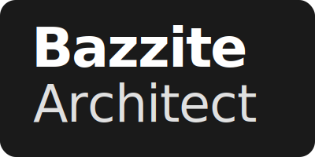

<p align="center">
  
  <br/>
  <br/>
  
  
  
  
</p>

# Bazzite Architect

A lightweight tool to create reproducible development environments on immutable Linux distributions (Bazzite / Fedora Kinoite).

---

## 🚀 Demo


*Creating a full Python environment and launching VS Code **in under 45 seconds** — UI remains fully responsive.*

---

## Introduction

Bazzite Architect is a desktop app that helps you keep development environments in sync on immutable Linux systems. It uses a small Rust backend and a React/Tauri frontend to manage Distrobox and DevContainer setups. A single manifest keeps the host container environment and the IDE container aligned while respecting the constraints of a read-only root filesystem.

For a technical deep dive, see ARCHITECTURE.md.

---
## Why use this?

### 1. Working outside of your IDE

If you exclusively work inside VS Code and only ever use the integrated terminal, you might not need this tool. DevContainers alone will work perfectly fine for you.

**But here is the catch on immutable distros:**
Because your root filesystem is read-only, you can't just `sudo dnf install` your project's dependencies on your host machine. 

So, what happens when you close VS Code but still want to run a quick build script, use a native git client, or test something in your regular system terminal (like Ptyxis or Alacritty)? 
**You hit a wall.** Your dependencies (like `gcc`, `cmake`, or Python packages) are locked inside the DevContainer. Your host terminal doesn't know they exist.

To fix this on an immutable OS, you need a **Distrobox** that acts as your mutable host replacement. But keeping your Distrobox and your DevContainer dependencies in sync manually is a frustrating, error-prone mess.

**The Use Case:**
Bazzite Architect solves exactly this. It gives you the freedom to work outside of your IDE. It uses a single manifest to automatically mirror your dependencies across both worlds. You get the perfect IDE integration of DevContainers *and* a fully capable native terminal environment in Distrobox, without writing the boilerplate twice.

### 2. For Newcomers to Immutable Linux
If you are coming from a traditional OS (like Ubuntu or Windows), the concept of rootless containers, Podman, and Distrobox can be overwhelming. You just want to write code. Instead of figuring out why a standard package installation fails, or wrestling with surgical terminal commands pointing to specific binary paths just to install a simple library, **Bazzite Architect abstracts the complexity away**. It gives you a simple GUI to spin up a working, isolated workspace in seconds without having to read pages of container documentation.

When you need a new system package (like a compiler or a specific library), you simply select it in the app's interface. The application automatically runs the necessary terminal commands in the background to install it in your host terminal and syncs it to your IDE environment at the same time.

### 3. Stop Fiddling with the Terminal: Your Control Center
Instead of googling cryptic commands or digging through config files, you manage your entire setup through a clean interface. Bazzite Architect handles the annoying parts of container management completely in the background.

- Click instead of Type: Start, stop, and manage your containers directly in the app without ever having to memorize a Podman or Distrobox command.
- Ready-to-code in 60 Seconds: With currently 5 pre-configured project setups, you’re ready to go in just three clicks, perfect for beginners who just want to get to work.
- Technical Hurdles Solved: The tool safely handles tricky tasks like relocating your Podman storage (GraphRoot), which is a common point of failure on immutable systems.
- Everything in Sync: It acts as the bridge that automatically keeps your Distrobox and DevContainers in sync, so your tools work identically everywhere.

---

## Key Technical Features

- Rust backend: fast and memory-safe code for background tasks.
- Rootless operation: uses user-level Podman/Distrobox so no root access is required.
- Single manifest: one .bazzite-architect.json controls synchronization between host Distrobox and DevContainer.
- Storage helpers: tools to move Podman user storage to another location to save space on constrained disks.

---

## Supported Environments

Bazzite Architect provides scaffolding and DevContainer sync for these ecosystems:

- Python (data science, AI, scripting)
- Node / React (frontend & fullstack)
- Rust (systems)
- Java (backend)
- C / C++ (native & embedded)

Each environment includes a starter manifest and suggested VS Code extensions. 

---

## Comparison

| Concern | Manual Distrobox / DevContainer Setup | Bazzite Architect |
|---|---:|---|
| Repeatable setup | ad-hoc scripts and manual edits | declarative manifest + scaffolding |
| Security model | varies by setup | rootless Podman with controlled mounts |
| Drift handling | manual reconciliation | manifest-driven sync |
| Disk management | manual moves | guided storage relocation |

---

## Roadmap

- ✅ MVP (done): environment creation, manifest-based sync, storage relocation
- 🔜 Next: drift detection and adoption flows
- 🔜 In progress: transactional rollback for sync operations


---

## Motivation: From "Nightmare Setup" to Native Flow

Bazzite Architect was born out of real-world friction. 

Coming from a Frontend background (React/TS), I faced a major hurdle when moving my AI research - local training of OpenCV and ResNet models - to **Bazzite**. In a prior project (Goldgrube Coin Tool) I relied on ResNet models and local toolchains; you can find that repository [here](https://github.com/Kubaguette/goldgrube-coin-tool). As an immutable distribution, the "Windows way" or even the "standard Linux way" of installing toolchains simply didn't work.

I found myself trapped in a **"Nightmare Setup"**:
- ❌ Traditional terminal Python installs failed on the read-only root.
- ❌ Fragmented Conda environments that didn't talk to VS Code properly.
- ❌ High barrier to entry for students and engineers new to immutable OSs.

**The Mission:**
I built this tool to ensure that no developer has to waste hours on environment plumbing again. Bazzite Architect bridges the gap, providing a frictionless, native-feeling UI to manage what used to be a complex, manual process.

---

## Quick Start & Requirements

These steps are intentionally concise. Expand them to match your environment and distribution.

### Prerequisites

- A modern immutable Linux installation (Bazzite, Kinoite, or compatible Fedora spin).
- Podman (rootless) available on the host.
- Distrobox installed for friendly host-container integration.
- Node >= 18 / npm or pnpm for frontend development.
- Rust (stable) + cargo for backend build.

---

### Installation (End-User)

Bazzite Architect is distributed as native packages (.deb and .rpm). Download the appropriate package for your distribution from the [Latest Release](https://github.com/Kubaguette/bazzite-architect/releases/latest) and install it:

- Debian/Ubuntu (.deb):

```sh
sudo apt install ./Bazzite-Architect_1.0.0_amd64.deb
```

(Or using dpkg: `sudo dpkg -i Bazzite-Architect_1.0.0_amd64.deb && sudo apt-get install -f`)

- Fedora/RHEL (.rpm):

```sh
sudo dnf install ./Bazzite-Architect-1.0.0.x86_64.rpm
```

*Note: Make sure Podman and Distrobox are available on your system (standard on Bazzite).*

---


### Installation (developer mode)

Development should run inside a mutable container (Distrobox/toolbox) because the host OS is immutable. Example:

```sh
# create or enter your mutable development container
# distrobox create --name devbox --image registry.fedoraproject.org/fedora-toolbox:latest --yes
distrobox enter devbox
```

1. Clone the repository and install dependencies

```sh
git clone https://github.com/Kubaguette/bazzite-architect.git
cd bazzite-architect
npm install

# On Fedora/Bazzite/Kinoite (and other dnf-based immutable spins) install additional native deps needed
# for WebKit/Gtk bindings and build tools before running the Tauri build:
sudo dnf install -y webkit2gtk4.1-devel libappindicator-gtk3-devel librsvg2-devel gtk3-devel gcc gcc-c++ make
```

2. Start the unified development workflow

```sh
# Run the unified dev command from the project root
npm run tauri dev
```

Note: npm run tauri dev compiles the Rust backend and starts the Vite dev server together, providing a single, integrated developer loop appropriate for immutable-host workflows. See ARCHITECTURE.md for additional environment caveats (for example, PKG_CONFIG for webkit bindings).

---

## Developer Hub

See ARCHITECTURE.md for design details and the sync logic. If you plan to contribute or review the system, start there.

---

## Contributing

We welcome contributions that respect the project's architecture and testing boundaries. Please consult ARCHITECTURE.md before making large structural changes; follow the Core → Commands → View separation and prefer small, reviewable PRs.

---

## Author

**Kubaguette**
*Frontend Engineer | Exploring Rust & Linux Systems*

- 🐙 [GitHub Profile](https://github.com/Kubaguette)
- 💰 Inspiration: [Goldgrube Coin Tool](https://github.com/Kubaguette/goldgrube-coin-tool)

---

## License

Bazzite Architect is distributed under the GNU General Public License v3.0. See LICENSE for details.

---

Built by developers, for the Bazzite community. Aiming for native, frictionless engineering.